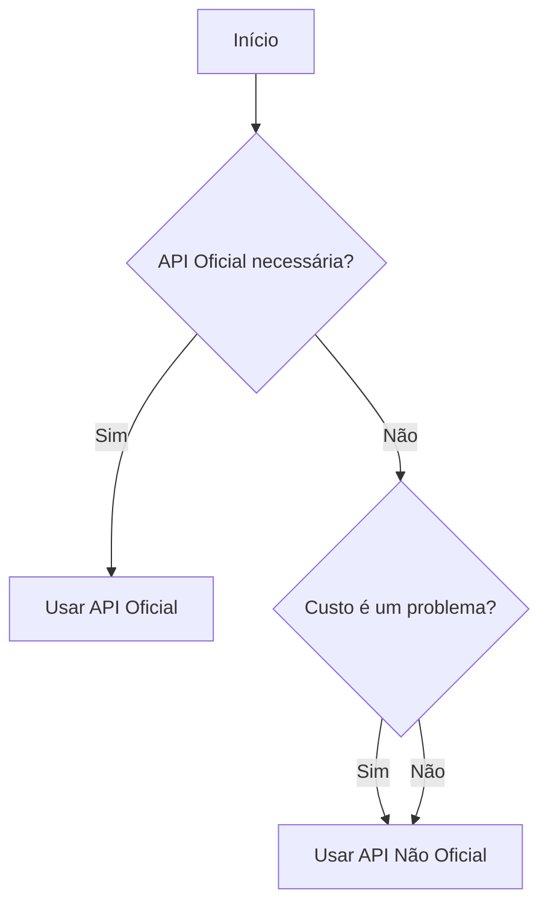

## **1. Pré-requisitos**

A etapa de pré-requisitos é o alicerce para garantir que seu ambiente esteja pronto para a instalação e operação do chatbot com o modelo de inteligência artificial LLaMA. Nesta seção, você encontrará todas as informações necessárias sobre hardware, software e configurações iniciais para que o projeto funcione de maneira adequada. Além disso, também é encontrado os passos para configurar a conta no WhatsApp Business, acessar o modelo LLaMA e validar o ambiente antes de avançar.  
Esta etapa é importante para evitar problemas futuros e garantir que todos os componentes estejam devidamente instalados e configurados. Revise os requisitos com cuidado e teste cada parte antes de seguir para as próximas etapas.

**Detalhando cada requisito:**


### **1.1 Hardware**

Dependendo da versão LLaMA ou do nível de processamento desejado, considere as opções abaixo:

- **Configuração Mínima Recomendada**:
  - **RAM**: 
    - 16GB para modelos menores do LLaMA (7B).
    - 32GB ou mais para modelos maiores (13B ou 65B).
  - **GPU**: Uma GPU NVIDIA com suporte a CUDA é altamente recomendada para acelerar inferências e treinos.
    - Memória de GPU: Pelo menos 8GB para inferência com modelos pequenos.
    - Para modelos maiores, GPUs de 16GB ou mais, como NVIDIA A100, RTX 3090 ou 4090.
  - **Armazenamento**:
    - SSD com pelo menos 100GB de espaço livre para armazenar modelos, dados de treinamento e logs.
  - **Processador**:
    - Pelo menos 4 núcleos (8 threads).
    - Processadores como Intel i7/i9 ou AMD Ryzen 7/9 são ideais.

- **Servidor ou Computador Local?**
  - Se o objetivo for usar o chatbot apenas localmente ou em pequena escala, um computador desktop pode ser suficiente.
  - Para uso em produção, considere um servidor local dedicado.


### **1.2 Software**

#### **Sistema Operacional**

- **Linux** é preferido devido à facilidade de uso com ferramentas de desenvolvimento e suporte a CUDA.  
- Para Windows:  
  - Instale o **Windows Subsystem for Linux (WSL2)** para melhor compatibilidade.

#### **Atualização do Sistema Operacional**

Garanta que seu sistema esteja atualizado para evitar conflitos com pacotes desatualizados.

#### **No Linux (Ubuntu/Debian):**
```bash
sudo apt update && sudo apt upgrade -y
```

#### **No Windows:**
Se estiver usando o **Windows Subsystem for Linux (WSL2)**:
```bash
sudo apt update && sudo apt upgrade -y
```

Se estiver rodando nativamente, atualize seu sistema pelo Windows Update.




                 Início
                   |
   ------------------------------------------
   |                                        |
API Oficial necessária?       Custo é um problema?
   |                                        |
   Sim                                      Sim
   |                                        |
Usar API Oficial             Usar API Não Oficial
   |
   Não
   |
Usar API Não Oficial


### **1.3 Linguagens e Gerenciadores**

- **Python** (3.8 ou superior):  
  Necessário para executar scripts de IA e ferramentas de integração.  
  Instale com:
  ```bash
  sudo apt install python3 python3-pip -y
  ```

- **Node.js** (para integração com WhatsApp):  
  Certifique-se de que você tem o **Node.js** instalado para usar ferramentas como Baileys.  
  Instale com:
  ```bash
  curl -fsSL https://deb.nodesource.com/setup_16.x | sudo -E bash -
  sudo apt install nodejs -y
  ```

#### **Verifique a versão do Node.js**  
Antes de instalar o Baileys, confirme a versão do Node.js instalada:
```bash
node -v
```

Certifique-se de que a versão instalada seja compatível com a biblioteca Baileys (recomendada: v16 ou superior).


### **1.4 Outros Requisitos de Ferramentas**

#### **Docker (Opcional, mas Recomendado)**

Usar Docker facilita a instalação de dependências e mantém o ambiente isolado. Para instalar:
```bash
sudo apt update
sudo apt install docker.io -y
sudo systemctl enable --now docker
```

Para verificar a instalação:
```bash
docker --version
```


### **1.5 Testes de Pré-Configuração**

Antes de iniciar a instalação e a execução do chatbot, é fundamental validar se o ambiente operacional está configurado corretamente e se todas as ferramentas necessárias estão instaladas. Realizar esses testes garantirá que seu sistema esteja preparado para rodar o chatbot com a inteligência artificial LLaMA de maneira eficaz.


#### **Verifique a versão do Python**
```bash
python3 --version
```

#### **Teste o Node.js**
```bash
node -v
```

#### **Confirme o funcionamento do Docker**
```bash
docker run hello-world
```

#### **Certifique-se de que a GPU está configurada corretamente (se aplicável)**
```bash
nvidia-smi
```


### **1.6 Requisitos Específicos do Projeto**

#### **Conta no WhatsApp Business**
- **API Oficial**:  
  Registre-se no [Meta for Developers](https://developers.facebook.com/) e crie um aplicativo.  

- **API Não-Oficial (Baileys)**:  
  Configure um número dedicado para o bot.

#### **Modelo LLaMA**
- Acesse o repositório oficial da Meta para LLaMA.  

#### **Acesso ao Servidor**
- Configure acesso via **SSH**.

