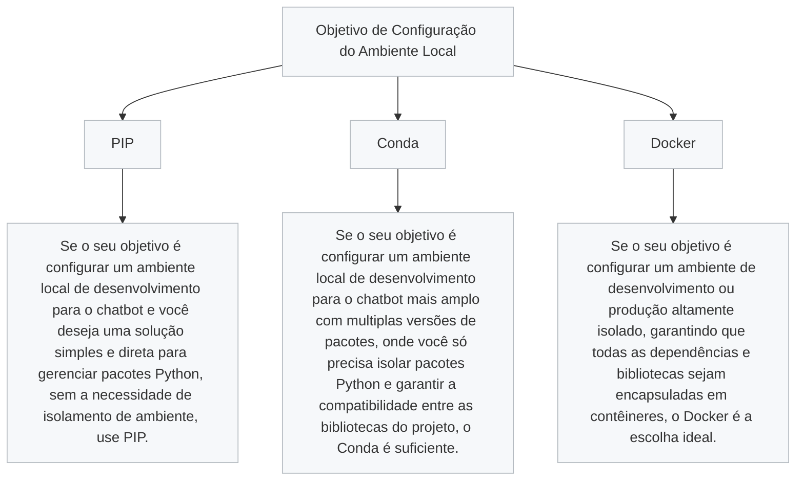

# **1. Pré-requisitos**

A etapa de pré-requisitos é o alicerce para garantir que seu ambiente esteja pronto para a instalação e operação do chatbot com o modelo de inteligência artificial LLaMA. Nesta seção, você encontrará todas as informações necessárias sobre hardware, software e configurações iniciais para que o projeto funcione de maneira adequada. Além disso, também é encontrado os passos para configurar a conta no WhatsApp Business, acessar o modelo LLaMA e validar o ambiente antes de avançar.  
Esta etapa é importante para evitar problemas futuros e garantir que todos os componentes estejam devidamente instalados e configurados. Revise os requisitos com cuidado e teste cada parte antes de seguir para as próximas etapas.

**Detalhando cada requisito:**

## **1.1 Hardware**

Dependendo da versão LLaMA ou do nível de processamento desejado, considere as opções abaixo:

- **Configuração Mínima Recomendada**:
  - **RAM**: 
    - 16GB para modelos menores do LLaMA (7B).
    - 32GB ou mais para modelos maiores (13B ou 65B).
  - **GPU**: Uma GPU NVIDIA com suporte a CUDA é altamente recomendada para acelerar inferências e treinos.
    - Memória de GPU: Pelo menos 8GB para inferência com modelos pequenos.
    - Para modelos maiores, GPUs de 16GB ou mais, como NVIDIA A100, RTX 3090 ou 4090.
  - **Armazenamento**:
    - SSD com pelo menos 100GB de espaço livre para armazenar modelos, dados de treinamento e logs.
  - **Processador**:
    - Pelo menos 4 núcleos (8 threads).
    - Processadores como Intel i7/i9 ou AMD Ryzen 7/9 são ideais.

- **Servidor ou Computador Local?**
  - Se o objetivo for usar o chatbot apenas localmente ou em pequena escala, um computador desktop pode ser suficiente.
  - Para uso em produção, considere um servidor local dedicado.
## **1.2 Software**
#### **Sistema Operacional**

- **Linux** é preferido devido à facilidade de uso com ferramentas de desenvolvimento e suporte a CUDA.  
- Para Windows:  
  - Instale o **Windows Subsystem for Linux (WSL2)** para melhor compatibilidade.

#### **Atualização do Sistema Operacional**

Garanta que seu sistema esteja atualizado para evitar conflitos com pacotes desatualizados.

#### **No Linux (Ubuntu/Debian):**
```bash
sudo apt update && sudo apt upgrade -y
```

#### **No Windows:**
Se estiver usando o **Windows Subsystem for Linux (WSL2)**:
```bash
sudo apt update && sudo apt upgrade -y
```

Se estiver rodando nativamente, atualize seu sistema pelo Windows Update.
## **1.3 Linguagens e Gerenciadores**

Para garantir que o ambiente esteja preparado para o funcionamento do modelo LLaMA, bibliotecas e ferramentas de integração, é necessário instalar a versão 3.8 ou superior do Python.
- **Python** (3.8 ou superior):  
Instale com:
  ```bash
  sudo apt install python3 python3-pip -y
  ```
#### **Definindo o objetivo**
Após instalação, decidida qual ferramenta utilizar para configurar o ambiente de desenvolvimento do seu chatbot. O organograma a seguir orienta sobre as opções disponíveis: PIP, Conda e Docker. Ele explica em que situações cada uma dessas ferramentas é mais adequada, considerando a necessidade de isolar pacotes, garantir compatibilidade entre bibliotecas ou configurar um ambiente completamente isolado. Essa escolha depende das suas necessidades específicas para o projeto e ajudará a facilitar o desenvolvimento do chatbot de forma mais eficiente.



Ao escolher entre **PIP**, **Conda** e **Docker**, é importante considerar as necessidades específicas do seu projeto e o nível de complexidade do ambiente de desenvolvimento. Cada uma das opções tem suas vantagens e limitações, e a escolha certa pode influenciar diretamente a eficiência, escalabilidade e a facilidade de manutenção do seu projeto.

- **PIP** é uma opção simples e rápida para ambientes Python, ideal para projetos menores ou quando se deseja um gerenciamento leve de dependências.
- **Conda** oferece um ambiente isolado, perfeito para projetos que exigem bibliotecas científicas ou ambientes pesados, como o uso de IA e GPUs.
- **Docker**, por sua vez, oferece a vantagem de criar contêineres totalmente isolados e portáteis, sendo a escolha ideal para garantir consistência entre diferentes sistemas, especialmente em ambientes de produção.

A tabela a seguir compara as três ferramentas com base nos seus prós e contras, ajudando a determinar qual delas é a mais adequada para seu projeto.


| **Característica**                   | **PIP**                                  | **Conda**                               |
|--------------------------------------|------------------------------------------|-----------------------------------------|
| **Gerenciamento de pacotes Python**   | Apenas pacotes Python.                  | Pacotes Python e não-Python (ex: bibliotecas de sistema). |
| **Gerenciamento de ambientes**       | Usado com `venv` ou `virtualenv`.       | Criação de ambientes completos (Python + dependências do sistema). |
| **Facilidade com dependências de sistema** | Não lida bem com dependências de sistema como CUDA, cuDNN, etc. | Lida automaticamente com dependências de sistema, ideal para IA. |
| **Instalação de pacotes de IA (ex: PyTorch, TensorFlow)** | Requer configuração manual para dependências de sistema. | Instalação simplificada com pacotes otimizados para IA. |


Em linhas gerais, **Conda** seria a escolha mais indicada do que **PIP**, enquando o uso do **Docker** seria para projetos muito mais robustos. Portanto, para porjetos que preevem manutenção eficaz e aprendizado contínuio, **Conda** é recomendado. 
Aqui estão os principais motivos:

**1. Gerenciamento Completo de Ambientes e Dependências**

**LLaMA AI** depende de pacotes não apenas do Python, mas também de bibliotecas de sistema, como CUDA para aceleração de GPU e outras bibliotecas de baixo nível que são comuns em ambientes de machine learning.
**Conda** gerencia não apenas os pacotes Python, mas também pacotes de sistemas operacionais (como drivers, bibliotecas C, ou até mesmo ferramentas como ffmpeg ou libxml2). Isso facilita a instalação de todos os componentes necessários, além de garantir que o ambiente esteja completo e funcional.
Ao usar Conda, você evita potenciais problemas de compatibilidade entre pacotes Python e dependências de sistema, uma preocupação comum ao trabalhar com bibliotecas de deep learning.

**2. Facilidade para Criar Ambientes Isolados**

O Conda facilita a criação de ambientes isolados, o que é essencial em projetos de IA, onde as versões de bibliotecas podem ser sensíveis. Por exemplo, diferentes versões de PyTorch, TensorFlow ou CUDA podem ser necessárias dependendo do modelo e hardware que você está utilizando.
Criar ambientes virtuais com Conda assegura que as dependências do projeto (incluindo bibliotecas de IA e outras ferramentas como Docker) não conflitem com outras aplicações no sistema.

**3. Instalação Simples de Dependências Complexas**

Algumas bibliotecas que você pode precisar para este projeto, como CUDA, cuDNN, ou até mesmo NVIDIA Drivers, podem ser desafiadoras para instalar manualmente e garantir que estão configuradas corretamente para a aceleração por GPU.
O Conda lida com esses pacotes automaticamente. Por exemplo, ao instalar pacotes como PyTorch com Conda, ele já garante que todas as dependências de sistema, como drivers CUDA e bibliotecas, sejam corretamente instaladas e configuradas.

Para entender melhor as diferenças, as vantagens e desvantagens entre **PIP** e **Conda** no contexto do projeto, [**acesse aqui**]() .

Caso queria mais informações sobre  as vantagens e desvantagens entre **Conta** e **Docker** no contexto do projeto, **acesse aqui**. 


- **Node.js** (para integração com WhatsApp):  
  Certifique-se de que você tem o **Node.js** instalado para usar ferramentas como Baileys.  
  Instale com:
  ```bash
  curl -fsSL https://deb.nodesource.com/setup_16.x | sudo -E bash -
  sudo apt install nodejs -y
  ```

#### **Verifique a versão do Node.js**  
Antes de instalar o Baileys, confirme a versão do Node.js instalada:
```bash
node -v
```

Certifique-se de que a versão instalada seja compatível com a biblioteca Baileys (recomendada: v16 ou superior).


### **1.4 Outros Requisitos de Ferramentas**

#### **Docker (Opcional, mas Recomendado)**

Usar Docker facilita a instalação de dependências e mantém o ambiente isolado. Para instalar:
```bash
sudo apt update
sudo apt install docker.io -y
sudo systemctl enable --now docker
```

Para verificar a instalação:
```bash
docker --version
```


### **1.5 Testes de Pré-Configuração**

Antes de iniciar a instalação e a execução do chatbot, é fundamental validar se o ambiente operacional está configurado corretamente e se todas as ferramentas necessárias estão instaladas. Realizar esses testes garantirá que seu sistema esteja preparado para rodar o chatbot com a inteligência artificial LLaMA de maneira eficaz.


#### **Verifique a versão do Python**
```bash
python3 --version
```

#### **Teste o Node.js**
```bash
node -v
```

#### **Confirme o funcionamento do Docker**
```bash
docker run hello-world
```

#### **Certifique-se de que a GPU está configurada corretamente (se aplicável)**
```bash
nvidia-smi
```


### **1.6 Requisitos Específicos do Projeto**

#### **Conta no WhatsApp Business**
- **API Oficial**:  
  Registre-se no [Meta for Developers](https://developers.facebook.com/) e crie um aplicativo.  

- **API Não-Oficial (Baileys)**:  
  Configure um número dedicado para o bot.

#### **Modelo LLaMA**
- Acesse o repositório oficial da Meta para LLaMA.  

#### **Acesso ao Servidor**
- Configure acesso via **SSH**.

